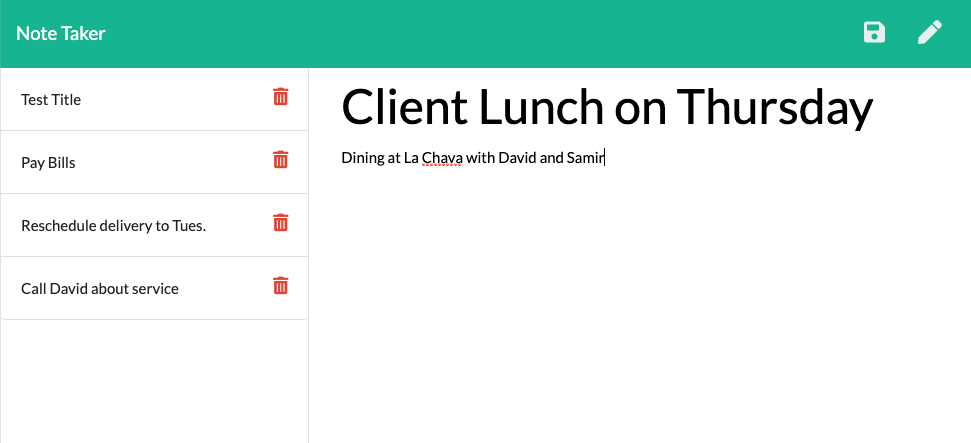

# note-taker

  ## Description
  
  ### User Story
  AS A small business owner <br>
  I WANT to be able to write and save notes <br>
  SO THAT I CAN organize my thoughts and keep track of tasks

  ## Table of Contents

  * [Installation](#installation)

  * [Usage](#usage)

  * [Screenshot](#screenshot)

  * [Contribution](#contribution)

  * [Questions](#questions)

  ## Installation

  To install necessary dependencies, run the following command:

  ```
  npm install
  ```

  ## Usage

  As a small business owner, managing tasks, ideas, and to-dos can feel daunting. This application helps small business owners easily create and save notes. When the user opens the page, they are presented with their existing notes on the left and the ability to make a new note on the right. Users are also able to save new notes, update existing notes, and delete notes.

  ## Screenshot 

  
  
 

  ## Contribution 

  All contributions are welcome. Please visit the [issues](https://github.com/pmac16/README-generator/issues) tab  to contribute.

  ## Questions

  If you have additional questions, please email me at priya.macpherson@gmail.com.

  Connect with me on GitHub! : [pmac16](https://github.com/pmac16)

### ©️Priya Macpherson

